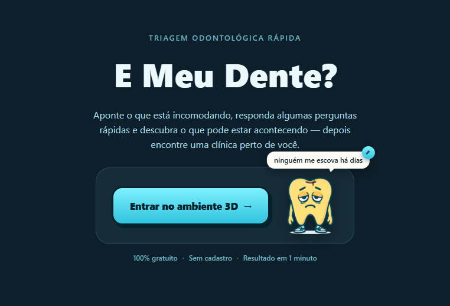
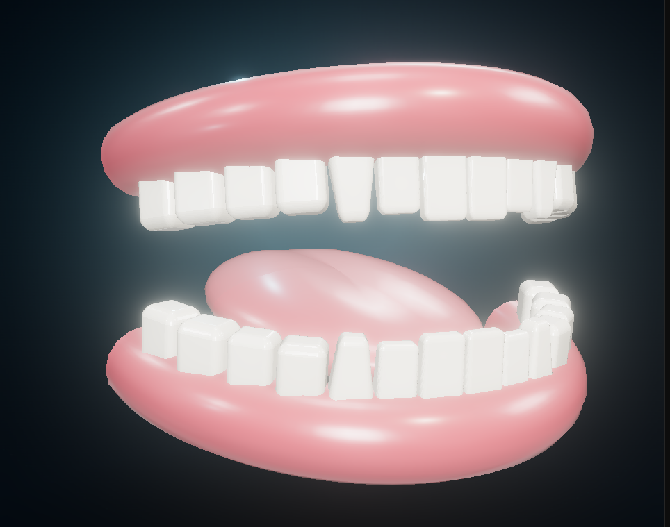

# 🦷 E Meu Dente? — Triagem odontológica 3D

Aponte o que está incomodando num modelo 3D interativo da boca, responda 3 perguntas rápidas e descubra o que pode estar acontecendo — depois encontre uma clínica perto de você num mapa de verdade.


**[Acesse o site em produção →](https://e-meu-dente-web.vercel.app)** — não precisa de cadastro, é só clicar em "Entrar no ambiente 3D".

> O backend roda no plano free da Render — se ninguém acessar por um tempo, a primeira requisição pode demorar uns segundos a mais pra "acordar" o servidor.

## Screenshots

| Landing | Modelo 3D |
|---|---|
|  |  |

## Sobre

A ideia surgiu de um incômodo bem específico: toda vez que dá uma dor de dente, a primeira coisa que eu (e acho que a maioria das pessoas) faz é procurar no Google tentando adivinhar o que pode ser, antes de decidir se vale a pena marcar uma consulta. Em vez de fazer só mais um formulário chato de perguntas, quis transformar isso numa experiência visual: você aponta o dente de verdade num modelo 3D, não escolhe "dente 26" de uma lista.

O fluxo é: escolher o dente clicando nele → dizer o que está sentindo → responder 3 perguntas de acompanhamento → receber uma triagem com nível de urgência e dicas → ver no mapa quais clínicas estão perto do endereço que você digitar.

## Por que fiz

Cansei de projeto de portfólio que é só mais um CRUD de tarefas ou e-commerce fake, então quis fazer algo que desse pra clicar e se divertir um pouco enquanto testa. Escolhi mexer com Three.js puro (sem react-three-fiber nem nada pronto) porque nunca tinha trabalhado com 3D de verdade e queria aprender mexendo direto com geometria, câmera e luz, em vez de só usar uma lib que já resolve isso por mim. No meio do caminho fui esbarrando em outras coisas que eu tinha pouca prática — deixar algo assim acessível por teclado, por exemplo — e fui resolvendo conforme aparecia.

## Funcionalidades

- Modelo 3D interativo da arcada dentária (32 dentes reais, cada um clicável)
- Seleção de dente por clique/toque **ou por teclado** (Tab + Enter), com brilho contínuo indicando o dente em foco
- Fallback automático pra quem não tem suporte a WebGL (navegador corporativo, driver bloqueado etc.)
- 6 tipos de sintoma por dente, cada um com 3 perguntas dinâmicas de acompanhamento
- Diagnóstico de triagem com nível de urgência (baixa/moderada/alta) e dicas de cuidado
- Busca de clínicas por endereço real (geocodificação via Nominatim/OpenStreetMap), com autocomplete e filtro de distância
- Distância calculada de verdade com a fórmula de haversine, não estimada
- Mapa interativo (Leaflet) mostrando sua localização e as clínicas encontradas como pins clicáveis
- Totalmente responsivo, incluindo o reenquadramento da câmera 3D pra telas estreitas
- Code splitting: o Three.js e o Leaflet só carregam quando realmente são usados

## Stack

- **Frontend**: React 19 + TypeScript + Vite + Three.js + Leaflet
- **Backend**: Node.js + Express 5 + Zod (validação) + Helmet + express-rate-limit
- **Geocodificação**: Nominatim (OpenStreetMap), sem chave de API
- **Testes**: Vitest (unit, frontend e backend) + React Testing Library + Supertest
- **CI/CD**: GitHub Actions (lint + testes + build a cada push)
- **Deploy**: Vercel (frontend) + Render (backend), monitorado com UptimeRobot

## Arquitetura

```
Consultoriooooo/
├── apps/
│   ├── web/                     # frontend (React + Vite)
│   │   └── src/
│   │       ├── components/      # MouthScene (cena 3D), Landing, SymptomPanel,
│   │       │                    # QuestionFlow, ResultScreen, ClinicMap, NoWebGLFallback
│   │       ├── api/             # client.ts — chamadas fetch pro backend
│   │       ├── data/            # perguntas dinâmicas por sintoma
│   │       └── utils/           # deteccao de suporte a WebGL
│   └── api/                     # backend (Express)
│       └── src/
│           ├── routes/          # diagnosis, clinics, geocode, health
│           ├── services/        # geocoding (Nominatim), clinics (haversine)
│           ├── middleware/      # tratamento de erro
│           └── data/            # base curada de clinicas (nome/endereco/coordenadas reais)
└── .github/workflows/ci.yml     # lint + testes + build no GitHub Actions
```

É um monorepo com workspaces do pnpm — `apps/web` e `apps/api` são pacotes independentes, cada um com seu próprio `package.json`, mas compartilham o lockfile da raiz.

## Rodando localmente

```bash
git clone https://github.com/Pedroaruana/E-Meu-Dente-.git
cd E-Meu-Dente-
pnpm install

# sobe o frontend (localhost:5173) e o backend (localhost:3333) juntos
pnpm dev
```

Se quiser rodar cada um separado:

```bash
pnpm dev:web   # só o frontend
pnpm dev:api   # só o backend
```

### Testes

```bash
pnpm --filter web test    # vitest do frontend
pnpm --filter api test    # vitest do backend
pnpm --filter web lint    # oxlint
```

## Desafios

**Clique num dente "reiniciava" a cena inteira** — o `useEffect` que monta a cena Three.js tinha `onToothSelected` nas dependências. Como esse callback vem do componente pai e muda de referência a cada render, clicar num dente recriava o efeito inteiro — destruindo e remontando todo o WebGL, o que parecia um refresh de página bem no meio da interação. A correção foi guardar a versão mais recente do callback numa `ref` em vez de depender dela diretamente no efeito.

**Busca de clínicas via Overpass API não era confiável** — a ideia original era buscar clínicas reais em tempo real via Overpass (OpenStreetMap). Só que em produção o serviço às vezes recusava requisições ou demorava demais, o que deixaria a demo instável bem na hora de mostrar pra alguém. Troquei por uma base curada de clínicas com coordenadas reais — a busca continua fazendo geocodificação de verdade (Nominatim) e cálculo de distância de verdade (haversine), só a lista de clínicas em si que é fixa.

**Mapa carregava mas sem nenhum pin** — depois de integrar o Leaflet, o mapa aparecia certinho, tiles carregando e tudo, só que sem nenhum marcador visível — nem o da minha localização, nem o das clínicas. Levei um tempo pra entender que não era bug no meu código: o Leaflet aponta pra uns `.png` de ícone dentro do próprio pacote, e o Vite não sabe resolver esse caminho sem uma configuração extra que eu não tinha. Em vez de ficar mexendo na config do bundler pra puxar uma imagem genérica, troquei pelos ícones prontos por `L.divIcon` — bolinhas desenhadas em CSS, que de quebra ficaram na cor do resto do site em vez do azul padrão do Leaflet.

**CORS depois do deploy** — o backend só aceitava requisições de `localhost:5173` (variável `CORS_ORIGIN`). Assim que troquei a URL de produção do Vercel na variável de ambiente da Render, esqueci que o serviço precisa de um redeploy pra aplicar — a primeira tentativa de busca no site publicado falhou silenciosamente até eu perceber que era bloqueio de CORS no navegador, não erro de rede.

---

Feito por Pedro — [github.com/Pedroaruana](https://github.com/Pedroaruana)

Projeto de código aberto — licença MIT
